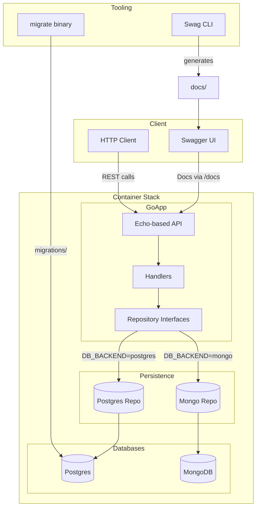

# Architecture Overview

- The API runs inside Docker Compose alongside Postgres, MongoDB, and a one-shot migration container.
- Handlers depend on repository interfaces, allowing runtime selection between Postgres and Mongo implementations via `DB_BACKEND`.
- Swagger UI serves generated documentation while clients interact through the same Echo server.
- `migrate` applies SQL migrations only when Postgres is selected; Mongo uses ad-hoc seeding.
